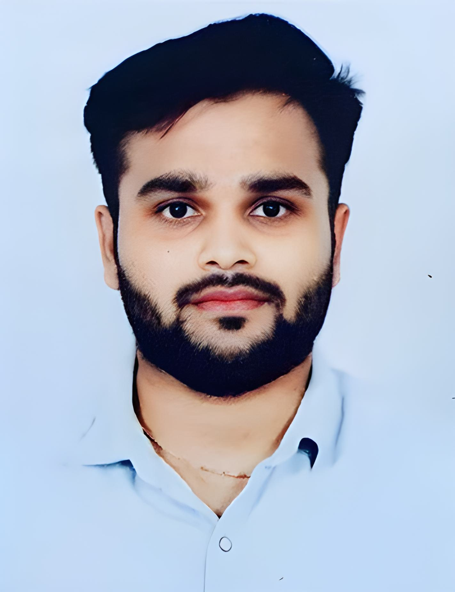

# 🧑‍💻 About Me

## 👋 Introduction
Hello! I'm **Prince Kansagra**, an AI Engineer based in San Francisco. With over 6 years of experience in data science and AI, I specialize in machine learning, predictive modeling, computer vision, and natural language processing. Outside of work, I enjoy working out, trekking, and playing soccer.

  
  
Hello! I'm **Prince Kansagra**, an AI Engineer based in San Francisco. With over 6 years of experience in data science and AI, I specialize in machine learning, predictive modeling, computer vision, and natural language processing. Outside of work, I enjoy working out, trekking, and playing soccer.

---

## 💼 Professional Experience

### Microsoft via TCS | AI Engineer (October 2023 – Present)
- **AI Innovation**: Spearheaded AI innovation using LLM and Generative AI.
- **Agile Project Execution**: Accelerated project timelines with fast sprints.
- **End-to-end Azure Solutions**: Leveraged Azure Cognitive Services, OpenAI Semantic Kernel, Microsoft Fabric, and Copilot for scalable solutions.
- **Global Collaboration**: Collaborated internationally across Microsoft AI Co-Innovation Lab sites.
- **Team Leadership**: Led cross-disciplinary teams for comprehensive project success.

### Assurant, TX via Influx Info Solutions | Data Scientist (Aug 2022 – Aug 2023)
- Conducted correlation analysis using Pyspark, PySQL, and Hadoop.
- Implemented real-time data processing with Apache Spark streaming API.
- Developed tabular-based models for targeted reporting solutions.
- Leveraged AWS Cloud platform for scalable data science solutions.
- Enhanced fraud detection algorithms with continuous monitoring.

### Impex Solutions | Data Scientist (Oct 2015 - May 2021)
- Developed a scalable ML solution for an e-commerce platform, increasing revenue by 10%.
- Optimized a recommendation engine, resulting in a 25% increase in click-through rates.
- Communicated technical concepts to senior executives, gaining support for data-driven initiatives.

---

## 🛠️ Skills and Technologies

- **Languages**: `Python`, `R`, `SQL`, `SAS`
- **ML Algorithms**: `Linear Regression`, `Logistic Regression`, `Decision Trees`, `SVM`, `Random Forests`, `Naive Bayes`, `KNN`, `K Means`, `CNN`, `RNN`, `LSTM`
- **Packages**: `Langchain`, `Semantic Kernel`, `Llama-index`, `NumPy`, `Pandas`, `Matplotlib`, `SciPy`, `Scikit-learn`, `Seaborn`, `TensorFlow`, `Ggplot2`, `Pytorch`, `OpenCV`
- **Big Data Ecosystem**: `Hadoop`, `Apache Spark`
- **Visualization Tools**: `Tableau`, `Power BI`
- **Cloud Technologies**: `AWS`, `Azure`
- **Databases**: `SQL Server`, `MySQL`
- **Other Tools**: `Git`, `MS Excel`
- **Operating Systems**: `Windows`, `Linux`

---

## 🎓 Education

- **Master’s in Business Analytics with Minor in Data Science**
  - The University of Texas at Dallas | GPA: 3.6/4.0
  - Honors: Dean’s Excellence Scholar

- **Graduate Certificate in Applied Machine Learning**
  - The University of Texas at Dallas | GPA: 4.0/4.0

- **Bachelor of Technology in Civil Engineering**
  - Nirma University, Ahmedabad, India | GPA: 8.2/10

---

## 📜 Certifications

- **Machine Learning**, Stanford Online
- **Neural Networks and Deep Learning**, deeplearning.ai
- **Google Analytics Certified**, Google
- **AWS Academy Graduate - Machine Learning**
- **AWS Academy Graduate - Data Analytics**
- **Machine Learning Foundations**, Alteryx
- **AWS Cloud Solutions Architect – Associate**
- **Tableau Certified Data Analyst**

---

## 🌟 Personal Interests

- **Fitness**: Regularly working out to stay fit.
- **Outdoor Activities**: Enjoy trekking and exploring new trails.
- **Sports**: Passionate about playing soccer.

---

## 📞 Contact Information

- **Email**: [princekansagra99@gmail.com](mailto:princekansagra99@gmail.com)
- **LinkedIn**: [Prince Kansagra](http://linkedin.com/in/princekansagra)
- **GitHub**: [AI_Nerdachu 🤓⚡💻](http://github.com/AI_Nerdachu)

---

Thank you for visiting my profile! Feel free to reach out if you have any questions or would like to collaborate on exciting projects!
